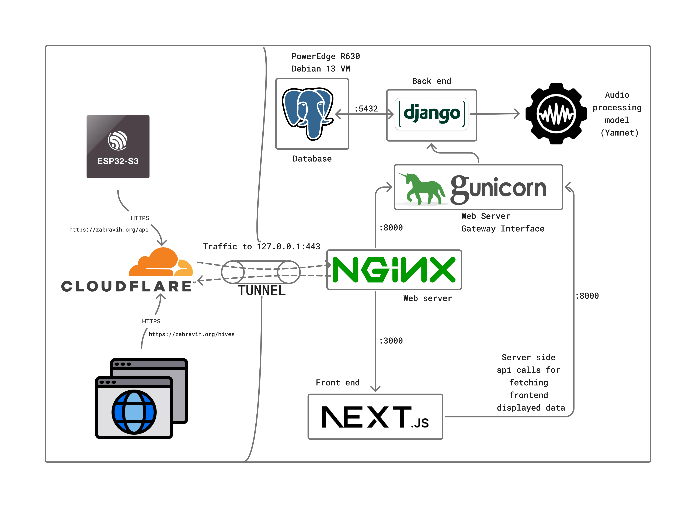

# SmeeHive

IoT система за интелигентно наблюдение на пчелни кошери в реално време. Устройства ESP32-S3, монтирани в кошерите, записват сензорни данни (температура, влажност, CO2) и аудио, което се анализира от ML модел базиран на YAMNet за засичане на присъствието на майката пчела.

## За проекта

Проектът включва:
- Django REST API бекенд, хостван с Gunicorn и Nginx
- Next.js фронтенд с интерактивно табло (графики, циферблати, шестоъгълна мрежа от кошери)
- ESP32-S3 фърмуер, събиращ температура, влажност, CO2 и аудио
- YAMNet ML модел за засичане на майката пчела от аудио записи
- PostgreSQL база данни за съхранение на измервания и метаданни
- BLE provisioning за конфигурация на WiFi credentials директно от устройството

### Как работи

1. ESP32-S3 устройството в кошера събира сензорни данни и записва 10-секунден аудио клип
2. Данните се изпращат към Django API чрез HTTPS multipart POST
3. Django стартира YAMNet ML модел, който анализира аудиото и определя статуса на майката (QNP / QPNA / QPR / QPO)
4. Резултатите се съхраняват в PostgreSQL и се визуализират в Next.js таблото
5. Пчеларят вижда графики за здравето на кошера и статус на майката в реално време

## Изградено с

  
  
  
  
  
  
  
  
  
  
  
  

## Архитектура

## Отбор

- [Iliya Iliev](https://github.com/lazy-mannn)
- [Alexander Grigorov](https://github.com/Mr-TopG)
- [Alexander Beshev](https://github.com/MrBeshev)
- [Antoan Tsonkov](https://github.com/smookie77)
- [Nevena Dimitrova](https://github.com/nevena331)
